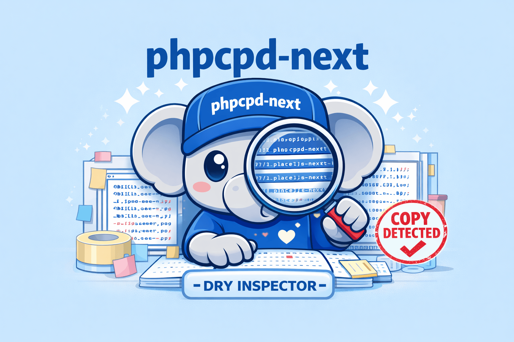

<p align="center">
  
</p>
    
# phpcpd-next

**Token-based copy/paste detection for PHP 8.5+ — a maintained successor to phpcpd, with reorder-tolerant (Type-3) detection.**

A maintained, dependency-free successor to the archived
[`sebastianbergmann/phpcpd`](https://github.com/sebastianbergmann/phpcpd). It finds duplicated
code — and, unlike most copy/paste detectors, it ships **three complementary detection engines**
so it can see exact copies, *reordered* clones, and *gapped* near-misses.

> Drop-in replacement: the command is still `phpcpd`. Out of the box it runs **Rabin-Karp +
> TokenBag** (exact and reordered duplication); the classic Rabin-Karp-only behaviour is one flag
> (`--rk`) away. The deeper research engines are opt-in.

## Features at a glance

- **Three token-based engines** — Rabin-Karp (exact) and TokenBag (reordered) run by default; the
  suffix tree (gapped Type-3) is an opt-in research engine.
- **Actionable console output** — every clone comes with a context-aware refactoring hint, plus a
  run summary (duplicated-line percentage, average and largest clone size).
- **Inconsistent-clone reporting** — with `--algorithm=suffixtree`, diverged near-misses are flagged
  `[inconsistent]` (the bug-prone kind: one copy patched, its sibling not).
- **Four output formats** — human-readable console, PMD-CPD XML, JSON, and SARIF 2.1.0.
- **CI-ready** — meaningful exit codes, result caching, and a per-file incremental index.
- **Framework presets** — `--preset=laravel` (and an extensible preset format).
- **Headless API + PHPUnit integration** — embed detection in tests or tools, no shelling out.
- **PHP 8.5+, zero runtime dependencies, deterministic** — same input, same result, every run.

---

## Why another clone detector?

The common wisdom is that phpcpd only finds Type-1/2 (exact / renamed) clones. That was only ever
true of its *default* engine. phpcpd-next exposes and extends the full picture:

| Clone type | Example | Engine | Availability |
|------------|---------|--------|--------------|
| **Type-1** exact | identical code | `rabin-karp` | **default** |
| **Type-3** reordered | statements shuffled within a function | `tokenbag` | **default** |
| **Type-3** gapped | a statement inserted/deleted/changed | `suffixtree` | advanced (`--algorithm`) |
| **Type-2** renamed | same code, different identifiers | any engine | advanced (`--fuzzy`) |

The two **default** engines run together on every `phpcpd <dir>` invocation. The Type-3-gapped and
Type-2 capabilities are research-grade and opt-in (see [Advanced engines](#advanced-engines--research)).

The suffix-tree engine additionally flags **inconsistent clones** — near-miss copies that have
diverged — which is where duplication tends to hide bugs (one copy patched, its sibling not).

## Requirements

- PHP **8.5+**
- ext-dom, ext-mbstring

**Zero Composer dependencies.** Nothing from the PHPUnit/sebastian release train at runtime.

## Installation

Install as a dev dependency from [Packagist](https://packagist.org/packages/phpcpd-next/phpcpd):

```bash
composer require --dev phpcpd-next/phpcpd
```

This installs the `phpcpd` binary to `vendor/bin/phpcpd`:

```bash
vendor/bin/phpcpd --version
vendor/bin/phpcpd src/
```

Or run it without adding it to your project, via Composer's global bin or a one-off:

```bash
composer global require phpcpd-next/phpcpd   # then: ~/.composer/vendor/bin/phpcpd
```

From source:

```bash
git clone https://github.com/phpcpd-next/phpcpd.git
cd phpcpd && composer install
./phpcpd --version
```

> Requires **PHP 8.5+** with `ext-dom` and `ext-mbstring`. **Zero runtime dependencies** — nothing
> from the PHPUnit/sebastian release train is pulled in.

## Quick start

```bash
# default: exact (Type-1) + reordered (Type-3) duplication, run together
phpcpd src/

# Rabin-Karp only — exact clones, faster, no reorder detection
phpcpd --rk src/

# scan a directory with a framework preset (sensible paths + excludes)
phpcpd --preset=laravel

# write a machine-readable report
phpcpd --log-sarif=phpcpd.sarif src/
```

phpcpd-next exits with status **1** when clones are found (or on error) and **0** when none are —
so it works as a CI gate out of the box.

### What a run looks like

```
Found 2 code clones with 21 duplicated lines in 2 files:

  - app/Services/Billing.php:12-33 (21 lines)
    app/Services/Invoicing.php:40-61
    → Consider extracting the shared lines into a reusable method or constant.

  - tests/UserTest.php:8-19 (11 lines)
    tests/AdminTest.php:8-19
    → Duplicate test scaffold — consider a shared base class or a @dataProvider.

37.50% duplicated lines out of 56 total lines of code.
Average code clone size is 10 lines, the largest code clone has 21 lines
```

Each clone is followed by a **context-aware refactoring hint** — the suggestion adapts to the clone
(test scaffolding, a large block, a diverged near-miss, or a plain extract). The closing summary
reports the **duplicated-line percentage** and the average/largest clone size. Add `--verbose` to
print the duplicated source itself.

## Detection engines

### Default: Rabin-Karp + TokenBag

Every `phpcpd <dir>` run executes two engines and merges their results:

- **Rabin-Karp** — exact contiguous duplication via a rolling hash. Fast; the classic phpcpd
  behaviour for Type-1 clones.
- **TokenBag** — order-invariant overlap (a SourcererCC-style token bag + inverted index). Catches
  clones where statements were **reordered** within a function — which contiguous matching cannot.

They are complementary: Rabin-Karp is precise about structure; the token bag tolerates shuffling.
Pass **`--rk`** to run Rabin-Karp alone (faster, no reorder detection).

### Advanced engines / research

These are opt-in via the (hidden) `--algorithm` flag and its tuning knobs. They are research-grade
— powerful on the right corpus, but with higher false-positive rates on real-world code, which is
why they are not in the default set or in `--help`.

- **`--algorithm=suffixtree`** — approximate matching with a configurable edit budget
  (`--edit-distance`, default 5). Detects **gapped (Type-3)** clones where statements were inserted,
  deleted, or changed, and marks diverged copies as `[inconsistent]`. Type-aware: a changed control
  keyword (`if`→`while`) costs more of the edit budget than a renamed identifier. Tune the
  exact-match prefix with `--head-equality` (default 10).
- **`--algorithm=tokenbag`** — run the token bag alone (rather than merged with Rabin-Karp). Tune
  the overlap threshold with `--min-similarity` (default 0.7).
- **`--algorithm=rabin-karp`** — explicit single-engine Rabin-Karp (equivalent to `--rk`).
- **`--fuzzy`** — rename-insensitive (**Type-2**) matching: identifiers and literals are abstracted
  to type classes. **`--type-anchored`** is the same but preserves type keywords.

```bash
phpcpd --algorithm=suffixtree --edit-distance=8 src/    # gapped clones, wider budget
phpcpd --fuzzy src/                                      # renamed-identifier clones
```

## Output formats

The console report is human-readable and always printed; add `--verbose` to print the duplicated
source of each clone. Machine-readable reports are written to a file in parallel:

| Format | Flag | For |
|--------|------|-----|
| **Console** (text) | *(default)* | humans; add `--verbose` for the duplicated snippet |
| **PMD-CPD XML** | `--log-pmd=<file>` | Jenkins, SonarQube, and other PMD-CPD consumers |
| **JSON** | `--log-json=<file>` | scripts and custom dashboards (`tool`, `version`, `summary`, `clones[]`) |
| **SARIF 2.1.0** | `--log-sarif=<file>` | GitHub Code Scanning / the Security tab |

```bash
phpcpd --log-pmd=report.xml --log-json=report.json --log-sarif=report.sarif src/
```

You can request several at once. SARIF maps **inconsistent clones to `warning`** and exact clones
to `note`, so the bug-bearing duplication surfaces at a higher severity.

### GitHub Code Scanning

```yaml
- name: Detect duplicated code
  run: vendor/bin/phpcpd --log-sarif=phpcpd.sarif src/ || true

- name: Upload results
  uses: github/codeql-action/upload-sarif@v3
  with:
    sarif_file: phpcpd.sarif
```

Clones then appear as annotations in the PR and in the repository's Security tab. (Swap in
`--algorithm=suffixtree` if you also want gapped/inconsistent clones surfaced.)

## Options

The full set shown by `phpcpd --help`:

```
Options for selecting files:
  --suffix <suffix>       Include files ending in <suffix> (default: .php; repeatable)
  --exclude <path>        Exclude paths (substring or glob, e.g. '*.blade.php'; repeatable)
  --preset <name>         Apply a framework preset (e.g. laravel): paths, suffixes, excludes

Options for analysing files:
  --rk                    Rabin-Karp only (exact/Type-1; faster, no reorder detection)
  --min-lines <N>         Minimum identical lines (default: 5)
  --min-tokens <N>        Minimum identical tokens (default: 70)
  --verbose               Print the duplicated code for each clone

Options for report generation:
  --log-pmd <file>        PMD-CPD XML
  --log-json <file>       JSON
  --log-sarif <file>      SARIF 2.1.0 (GitHub Code Scanning)

Options for CI integration:
  --cache                 Cache results in '.phpcpd-cache/' for faster re-runs
  --cache-dir <path>      Cache directory (implies --cache; overrides default)
  --incremental           Per-file index: re-tokenize only changed files (rabin-karp)

General:
  -h, --help              Print help
  -v, --version           Print version
```

### Advanced / research flags

Parsed but hidden from `--help` — research-grade, see [Advanced engines](#advanced-engines--research):

```
  --algorithm <name>      'rabin-karp', 'suffixtree', or 'tokenbag' (single-engine override)
  --fuzzy                 Rename-insensitive (Type-2) matching
  --type-anchored         Like --fuzzy but preserves type keywords
  --edit-distance <N>     Edit budget (suffixtree only; default: 5)
  --head-equality <N>     Exact-match prefix length (suffixtree only; default: 10)
  --min-similarity <0-1>  Minimum token-bag overlap (tokenbag only; default: 0.7)
```

## Framework presets

A preset is a named bundle of sensible defaults — scan paths, file suffixes, and
exclude patterns — for a given framework. It is **pure configuration**: no runtime
dependency, no change to how detection works, so it stays faithful to the
zero-dependency, deterministic core. Presets exist because every framework has
predictable noise (generated caches, scaffolded CRUD, migration boilerplate) that
buries real findings; a preset encodes that knowledge once.

```bash
# Scans app/ routes/ database/ config/ and skips vendor, storage,
# bootstrap/cache, public, Blade views, and migration boilerplate.
phpcpd --preset=laravel
```

Explicit flags always win: a preset **seeds** the defaults, then `--exclude` and
`--suffix` *append* to it and `--min-lines` / `--min-tokens` *override* it. Passing a
directory overrides the preset's default paths (its excludes still apply):

```bash
phpcpd --preset=laravel app/Services --min-tokens=60 --exclude=app/Generated
```

| Preset | Scans | Skips |
|--------|-------|-------|
| `laravel` | `app routes database config` | `vendor`, `node_modules`, `storage`, `bootstrap/cache`, `public`, `*.blade.php`, `database/migrations`, IDE-helper files |

Presets are declared in one place (`src/Presets.php`); adding a framework is a single
`Preset` entry that the CLI, `--help`, and the headless API all pick up.

### Laravel via Artisan (optional)

There is no Laravel runtime dependency in phpcpd-next, and there does not need to be —
`--preset=laravel` is the integration. If you want `php artisan` ergonomics, a few
lines in your app wire the headless API (below) into a command; no extra package
required:

```php
// app/Console/Commands/CheckDuplication.php
use Illuminate\Console\Command;
use LucianoPereira\PhpcpdNext\Phpcpd;

final class CheckDuplication extends Command
{
    protected $signature   = 'duplication:check {--min-tokens=70}';
    protected $description = 'Detect copy/paste duplication in the application code';

    public function handle(): int
    {
        $clones = Phpcpd::detect(preset: 'laravel', minTokens: (int) $this->option('min-tokens'));

        foreach ($clones as $clone) {
            $this->warn(sprintf('%d lines duplicated:', $clone->numberOfLines()));

            foreach ($clone->files() as $file) {
                $this->line("  {$file->name()}:{$file->startLine()}");
            }
        }

        return $clones->count() === 0 ? self::SUCCESS : self::FAILURE;
    }
}
```

## Embedding phpcpd-next (headless mode)

Tools that want clone detection in-process — a PHPUnit assertion, an Artisan command,
a custom CI script — call the **headless API** instead of shelling out to the binary.
It finds files, runs the same engine the CLI uses, and returns the raw
`CodeCloneMap`; there is no banner, no argv parsing, and no file I/O, so it is safe to
call repeatedly in one process.

```php
use LucianoPereira\PhpcpdNext\Phpcpd;

$clones = Phpcpd::detect(
    paths: 'app',          // string or list of directories
    minTokens: 60,
    algorithm: null,       // null = Rabin-Karp + TokenBag; or 'suffixtree' / 'tokenbag'
    preset: 'laravel',     // optional; seeds paths/suffixes/excludes
);

foreach ($clones as $clone) {
    // $clone->numberOfLines(), $clone->files(), $clone->isGapped(), $clone->toArray()
}

echo $clones->count(), " clones\n";
```

## PHPUnit integration

Make duplication a **regression test**: a clone introduced in a pull request turns the
build red, with the offending locations printed in the failure message. Drop in the
shipped trait:

```php
use LucianoPereira\PhpcpdNext\PHPUnit\AssertNoDuplication;
use PHPUnit\Framework\TestCase;

final class DuplicationTest extends TestCase
{
    use AssertNoDuplication;

    public function test_app_is_dry(): void
    {
        $this->assertNoDuplication(__DIR__ . '/../app', minTokens: 70);
        // or, with a preset:  $this->assertNoDuplication(preset: 'laravel');
    }
}
```

On failure:

```
Failed asserting that the scanned code contains no duplicated code.
2 clones found:
  18 lines @ app/Services/Billing.php:42 ↔ app/Services/Invoicing.php:71
  [inconsistent] 24 lines @ app/Http/Controllers/UserController.php:90 ↔ app/Http/Controllers/AdminController.php:88
```

The trait and the underlying `DuplicationConstraint` live in
[`integration/phpunit/`](integration/phpunit/), autoloaded under
`LucianoPereira\PhpcpdNext\PHPUnit\` once phpcpd-next is a `require-dev` of your
project. phpcpd-next **dogfoods** it: its own `tests/SelfDryTest.php` uses this exact
trait to keep `src/` duplication-free across all three engines.

## Incremental caching (CI)

`--cache` stores the run's results keyed by a fingerprint of the configuration and a manifest of
every scanned file's hash. On a re-run with the **same files and config**, detection is skipped
entirely and the cached result is replayed (the run prints `(cache hit)`). Any changed, added, or
removed file is a miss and triggers a full re-scan. Different algorithm/threshold combinations get
separate cache entries, so they never collide.

Mount the cache directory with `actions/cache` to carry it between CI runs:

```yaml
- uses: actions/cache@v4
  with:
    path: .phpcpd-cache
    key: phpcpd-${{ hashFiles('**/*.php') }}
    restore-keys: phpcpd-
- run: ./phpcpd --cache-dir .phpcpd-cache src/
```

### Per-file incremental index (`--incremental`)

`--cache` is all-or-nothing: a single changed file invalidates the whole run. `--incremental`
(Rabin–Karp only) is finer-grained — it persists each file's tokenization keyed by a content hash,
and on a re-run **re-tokenizes only the files that changed**, replaying the rest straight from the
index. The run prints what it did, e.g. `(incremental index: 412 reused, 3 scanned)`.

The result is identical to a full scan — only the work differs — so it stays correct as files come
and go between runs. Use it on large codebases where most files are untouched between CI runs; mount
the same `.phpcpd-cache` directory with `actions/cache` as above. (Requested with another algorithm,
the flag is ignored and the run falls back to the coarse `--cache`.)

```yaml
- run: ./phpcpd --incremental --cache-dir .phpcpd-cache src/
```

## Lineage and license

phpcpd-next is a fork of `sebastianbergmann/phpcpd`, created by Sebastian Bergmann and archived in
2023. The original copyright is retained throughout; this fork is maintained by Luciano Federico
Pereira. Licensed under **BSD-3-Clause** — see [LICENSE](LICENSE).

The diff-by-diff story of the modernisation and the new detection capabilities lives in
[MODERNIZATION.md](MODERNIZATION.md); the research grounding is in the [paper](paper/token-based-clone-detection-for-php.pdf). Contributions are
welcome under the [Contributor License Agreement](CLA.md) — see [CONTRIBUTING.md](CONTRIBUTING.md).
