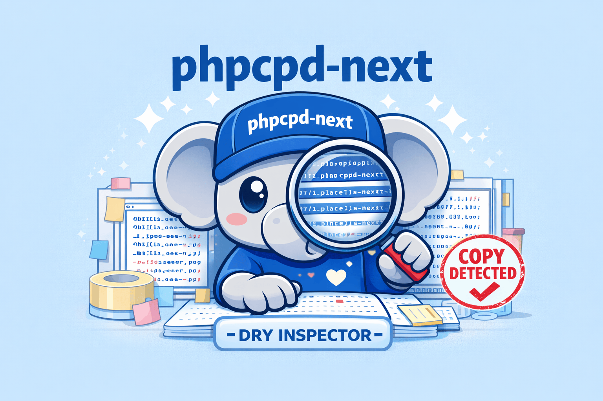

<p align="center">
  
</p>
    
# phpcpd-next

  **Token-based copy/paste detection for PHP 8.4+ — a maintained successor to
  phpcpd, with reorder-tolerant (Type-3) detection.**

  A maintained, dependency-free successor to the archived
  [`sebastianbergmann/phpcpd`](https://github.com/sebastianbergmann/phpcpd).
  It finds duplicated code — and, unlike most copy/paste detectors, it ships
  **three complementary detection engines** so it can see exact copies,
  *reordered* clones, and *gapped* near-misses.

> Drop-in replacement: the command is still `phpcpd`. Out of the box it runs
> **Rabin-Karp + TokenBag** (exact and reordered duplication); the classic
> Rabin-Karp-only behaviour is one flag (`--rk`) away. The deeper research
> engines are opt-in.

## Features at a glance

- **Three token-based engines** — Rabin-Karp (exact) and TokenBag
  (reordered) run by default; the unified engine (all four clone types from
  one anchor set) is opt-in via `--algorithm=unified`.
- **Every finding says what kind it is** — a copy that diverged is flagged
  `[inconsistent]` (the bug-prone kind: one copy patched, its sibling not),
  one whose material was rearranged is flagged `[reordered]`, and anything
  unflagged is an exact match. `--algorithm=unified` additionally names the
  divergent token ranges on both sides rather than only setting the flag.
- **Orphan detection (`--orphans`)** — find unreferenced classes,
  interfaces, traits, enums, and functions, with four result tiers,
  structural suppression rules, and framework entry-point awareness.
- **Generated and cache trees excluded by default** — a tool cache is a
  dense index of the very identifiers an orphan scan searches for, so
  scanning one can turn a failing gate green.
- **Suppression you can audit** — deliberate duplication is marked in
  comments, and a suppressed symbol is still counted and listed on demand
  rather than silently dropped.
- **`phpcpd.ini`** — per-project settings whose keys are the long option
  names, with `--show-config` to see what is in force and which layer set
  it.
- **Actionable console output** — every clone comes with a context-aware
  refactoring hint, plus a run summary (duplicated-line percentage, average
  and largest clone size).
- **Four output formats** — human-readable console, PMD-CPD XML, JSON, and
  SARIF 2.1.0.
- **Twenty-eight languages** — every sentence the tool prints is read from
  `locale/`, chosen with `--language=fr`; a translation is one file and may be
  partial, falling back to English per key.
- **CI-ready** — meaningful exit codes, result caching, and a per-file
  incremental index.
- **Framework presets** — auto-detected from the project's own manifest, or
  `--preset=laravel` (and an extensible preset format).
- **Headless API + PHPUnit integration** — embed detection in tests or
  tools, no shelling out.
- **PHP 8.4+, zero runtime dependencies, deterministic** — same input, same
  result, every run.

---

## Why another clone detector?

The common wisdom is that phpcpd only finds Type-1/2 (exact / renamed)
clones. That was only ever true of its *default* engine. phpcpd-next exposes
and extends the full picture:

| Clone type | Example | Engine | Availability |
|------------|---------|--------|--------------|
| **Type-1** exact | identical code | `rabin-karp` | **default** |
| **Type-3** reordered | statements shuffled within a function | `tokenbag` | **default** |
| **Type-3** gapped | a statement inserted/deleted/changed | `unified` | advanced (`--algorithm`) |
| **Type-2** renamed | same code, different identifiers | any engine | **default** |

The two **default** engines run together on every `phpcpd <dir>` invocation.
Rabin-Karp matches under identifier normalization, so a renamed copy is found
without asking; `--raw` turns that off and matches exact text, which is what
earlier versions did. Only the Type-3-gapped capability is opt-in (see
[Advanced engines](#advanced-engines--research)).

TokenBag does **not** take the normalized view, and that is deliberate rather
than an oversight. A token bag is order-free, and normalization folds every
identifier to one placeholder and every literal to another — together those
erase what tells one data table from another, so two tables of the same shape
become the same multiset. Measured on symfony/string, where the data tables
live, two blind raters put the bag's precision at 0.857 on the raw view and at
0.200 and 0.133 on the normalized one. Order is what protects the contiguous
matcher from the same mistake, and the bag has thrown order away. The cost is
that a copy which is *both* renamed *and* reordered is out of the default's
reach.

TokenBag's order-invariant overlap usually spans a gap rather than stopping
at it, so it *finds* most gapped clones. What it does not do is **locate**
the divergence: it establishes that two blocks hold the same material and
says nothing about the sequence, which is why its findings are reported as
`[reordered]` and never as exact. `--algorithm=unified` goes further and
flags a clone whose copies have diverged as `[inconsistent]` — which is where
duplication tends to hide bugs, one copy patched and its sibling not — and
names the token range that diverged on each side, so the finding can be acted
on without diffing the two copies by hand.

## Requirements

- PHP **8.4+**
- ext-dom, ext-mbstring

**Zero Composer dependencies.** Nothing from the PHPUnit/sebastian release
train at runtime.

## Installation

Install as a dev dependency from
[Packagist](https://packagist.org/packages/phpcpd-next/phpcpd):

```bash
composer require --dev phpcpd-next/phpcpd
```

This installs the `phpcpd` binary to `vendor/bin/phpcpd`:

```bash
vendor/bin/phpcpd --version
vendor/bin/phpcpd src/
```

Or run it without adding it to your project, via Composer's global bin or a
one-off:

```bash
composer global require phpcpd-next/phpcpd   # then: ~/.composer/vendor/bin/phpcpd
```

From source:

```bash
git clone https://github.com/phpcpd-next/phpcpd.git
cd phpcpd && composer install
./phpcpd --version
```

> Requires **PHP 8.4+** with `ext-dom` and `ext-mbstring`. **Zero runtime
> dependencies** — nothing from the PHPUnit/sebastian release train is
> pulled in.

## Quick start

```bash
# default: exact (Type-1) + reordered (Type-3) duplication, run together
phpcpd src/

# Rabin-Karp only — exact clones, faster, no reorder detection
phpcpd --rk src/

# scan a directory with a framework preset (sensible paths + excludes)
phpcpd --preset=laravel

# write a machine-readable report
phpcpd --log-sarif=phpcpd.sarif src/
```

phpcpd-next exits with status **1** when clones are found (or on error) and
**0** when none are — so it works as a CI gate out of the box.

### What a run looks like

```
Triage: files (56), removed (3) · unwired 2 · shadowed 1
  (--explain lists each file and the evidence for or against it)

Scan root: /home/you/app/src
Scanned files (56), roots (1), excludes (15)

Found clones (2), duplicated lines (32), files (4):

  - app/Services/Billing.php:12-33 (21 lines) +2.56
    app/Services/Invoicing.php:40-61
    → Consider extracting the shared lines into a reusable method, class, or trait.

  - tests/UserTest.php:8-19 (11 lines) +1.84
    tests/AdminTest.php:8-19
    → Consider extracting the shared lines into a reusable method, class, or trait.

2 asserted, 0 demoted.
4.53% of scanned lines (706) are duplicated code.
Clone lines: average (16), largest (21).
```

Counts are written label-first — `files (56)`, `clones (2)` — so a line reads
correctly whether the number is one or a hundred, in English and in the
twenty-seven other languages the tool speaks.

Every run opens by naming the **resolved scan root** and the file count,
because the cheapest way to spot a contaminated or runaway scan is a number
wildly out of step with the project. If any directory could not be read, the
scope line says how many — a run that covered less of the tree than you
think should say so rather than report a clean result over a partial scan.

### Triage labels: what the scan thinks each file *is*

Before anything is measured, every run asks a question of each file it is
about to scan: is this program text? Four rungs answer it, and each of them
**proves** rather than guesses:

| label | what it means |
|-------|---------------|
| `derived` | outside the file set your own default excludes leave — a generated tree, a compiled cache |
| `unwired` | nothing in the project references anything the file declares |
| `shadowed` | every name it declares is autoloadable from another file |
| `foreign` | it declares only namespaces no `composer.json` above it claims, from outside every directory they wire |

**The default posture discards: a labelled file is not scanned.** Duplication
inside a dead file is a different fact from duplication inside live code, and
on a real application most of it turns out to be the former — better than half
of what this tool reported on a Laravel codebase was duplication among files
nothing references. Removing them is the cheapest correct fix available, and
it is also the fastest: the same scan runs in about half the time.

It is also the one thing here that can lose you a finding. A rung that is
wrong about a file takes real duplication with it, so the stage announces what
it removed and counts its reasons, and `--explain` names the evidence for each
one so a removal can be argued with rather than merely obeyed.

Two ways to hold it back:

```bash
phpcpd --triage-posture=label src/     # decide and say so, but scan everything
phpcpd --no-triage src/                # skip the stage entirely
```

Under `label` the report is byte-for-byte what `--no-triage` produces, and the
test suite asserts that identity rather than claiming it in prose.

Nothing here reads a path, a directory or a filename. A file called
`dump.php` under `backup/` is judged by what references it, exactly as
`OrderService.php` under `app/` is.

Each clone is followed by a **context-aware refactoring hint** — the
suggestion adapts to the clone (test scaffolding, a large block, a diverged
near-miss, or a plain extract). The closing summary reports the
**duplicated-line percentage** and the average/largest clone size. Add
`--verbose` to print the duplicated source itself.

### Asserted and demoted findings

Some duplication is real and still not worth a reader's attention first: two
runs of rows in one data table, two route files registering the same
controllers. phpcpd-next says so rather than deciding for you. A finding is
either **asserted** — the tool is claiming it is duplicated logic — or
**demoted**, which means *found, reported, counted, and labelled with why
the tool is not asserting it*:

```
  - config/countries.php:21-34 (14 lines) [demoted: table]
    config/regions.php:18-31
```

```
1 asserted, 1 demoted (table 0 · registration 1).
```

Two reasons, and a finding carries one only when **every** one of its
occurrences qualifies:

| tag | what it means |
|-----|---------------|
| `table` | every occurrence sits wholly inside a statement-free array literal — a data table, not logic |
| `registration` | every occurrence sits in a file whose top-level statements are predominantly independent registration calls (a route table, a provider binding list) |

There was a third, `fishy`, decided by a trained classifier inside
`--triage`. It was **retired in
<!-- [[ $code.release ]] -->2.0.0<!--/-->** on the condition it shipped under: at the rating round that condition named, every demotion
it got right was already produced by the `table` tag's proof test, and the
two demotions it alone produced were findings both raters called genuine
duplication. Both remaining tags *prove* their case from the file's own
tokens; nothing here estimates.

**Demotion never suppresses.** Nothing is removed from any report, from the
counts, or from the exit code, and both halves are printed every run —
including the zeroes, so the split can be calibrated. A clone in a route
file *and* a controller is asserted, because the controller's copy is the
one you would want to see. Both tags are decided from file contents — never
from a path, a directory or a filename.

### Confidence ranking

Findings are printed **highest confidence first**, and each carries its
score:

```
  - app/Services/Billing.php:12-33 (21 lines) +1.85
  - config/countries.php:21-34 (14 lines) [demoted: table] -2.45
```

The number is log-odds — positive leans "duplicated logic", negative leans
"not" — from a small naive-Bayes model whose parameters are **counts over
this project's own rated findings**, not weights anybody chose. It asks four
questions of a finding: how many occurrences it has, whether they sit in one
file, how many lines it spans, and how much of its lead span is literal
values. `--verbose` names the three buckets that carried the score, so a
rank you disagree with can be argued with:

```
    · confidence -2.45 (literal -3.25, lines +0.56, sites +0.17)
```

**Ranking never filters.** Every finding is in the report either way; the
score decides what you read first, never what you get to read. The score is
exported in JSON (`confidence.logOdds` and its per-feature `terms`), PMD
(`confidence`) and SARIF (`properties.confidence`).

### Acknowledging duplication you are not fixing yet

Adopting a clone detector on a large existing codebase turns up duplication
a team knows about and is not going to fix this quarter. Writing hundreds of
`phpcpd-ignore` markers into source to say so would be editing a codebase to
change a report. The **acknowledgment ledger** is one committed file
instead:

```bash
# review what the tool found, then record it
phpcpd --write-acknowledged=.phpcpd-acknowledged src/

# from then on
phpcpd --acknowledged=.phpcpd-acknowledged src/
```

```
  - app/Legacy/Importer.php:88-140 (52 lines) [demoted: acknowledged] +1.12
    app/Legacy/Exporter.php:61-113
...
Acknowledged by the ledger: demoted (14) of findings (31), stale (1).
  stale (the code it acknowledged has changed): 22 lines · app/Old/A.php:9 ↔ app/Old/B.php:41
```

It is **not a baseline in the usual sense**, and the difference is the
point:

- **It demotes, it never hides.** An acknowledged finding is still reported,
  still counted, and still gates the exit code. A mechanism that made
  findings disappear would, over a few quarters, turn the report into a
  record of what nobody had got round to acknowledging yet.
- **Entries are keyed to the content of every side**, hashed — not to a path
  and not to a line number. So **editing either copy expires the entry** and
  the finding is asserted again, while moving or renaming the code changes
  nothing.
- **Expired entries are named**, so you can delete the line rather than let
  the file accumulate decisions about code that no longer exists.
- The counts print whenever a ledger is in use, including the zeroes.

The file is a tab-separated key and a human note, sorted, with a header that
explains itself to whoever meets it in a code review. Both `phpcpd-ignore`
markers and the ledger are available: markers are the right tool when the
duplication is deliberate design and the explanation belongs beside the
code; the ledger is the right tool when the honest statement is "we know,
not this quarter".

### What the percentage does and does not measure

The duplicated-line percentage counts **copied tokens, not repeated
design**. Those are different questions, and only the first one a clone
detector can answer.

A worked case from a real adoption: a 1,132-line controller whose seven
methods each repeat the same validate → cache → resolve → generate → stamp →
serve sequence reported **`1.06% duplicated`**, with both reported clones
correct and correctly located. Every method spelled the shared sequence with
its own variable names and its own call arguments, so at the token level
there was almost nothing to match — while at the design level the file was
the largest refactor candidate in the codebase.

Read a low percentage as *"little text was copied"*, never as *"this code
does not repeat itself"*. Structural repetition is a design review, and no
token-level tool substitutes for one.

## Detection engines

### Default: Rabin-Karp + TokenBag

Every `phpcpd <dir>` run executes two engines and merges their results:

- **Rabin-Karp** — exact contiguous duplication via a rolling hash. Fast;
  the classic phpcpd behaviour for Type-1 clones.
- **TokenBag** — order-invariant overlap (a SourcererCC-style token bag +
  inverted index). Catches clones where statements were **reordered** within
  a function — which contiguous matching cannot.

They are complementary: Rabin-Karp is precise about structure; the token bag
tolerates shuffling. Pass **`--rk`** to run Rabin-Karp alone (faster, no
reorder detection).

### Advanced engines / research

These are opt-in via the (hidden) `--algorithm` flag and its tuning knobs.
They are research-grade — powerful on the right corpus, but with higher
false-positive rates on real-world code, which is why they are not in the
default set or in `--help`.

**`--algorithm=suffixtree` was removed in <!-- [[ $code.release ]] -->2.0.0<!--/-->**, along with `--edit-distance` and `--head-equality`,
which were its knobs and nothing else's. It was the one component of this
package that was not the project's own work — a PHP port of the ConQAT
toolkit's approximate-clone suffix tree, carrying an Apache-2.0 attribution
the rest of the tree does not need — and it did not scale: 67 files 1.58 s
against the default engine's 0.10 s, 208 files over 300 s (killed) against
3.60 s, and on a large repetitive application 50 files in 199 s against the
unified engine's 0.63 s. Its `[inconsistent]` capability is superseded by
`--algorithm=unified`, which reports the same divergence and names the token
ranges that diverged on each side instead of only setting a flag.

The honest limitation, recorded rather than dropped with the code: **on the
pure-insert recall family the tree led.** On the mutation-injection curves
(`bench/run-recall.php --sample=40 --min-tokens=50`) it recalled 100.0 /
100.0 / 85.6 % at the three insert densities, where the unified engine of
that measurement recalled 97.3 / 79.8 / 70.1 %. The tree's numbers cannot be
re-run now that the code is gone, so they stand as recorded; the unified
engine's have since moved, and the same instrument at the same settings now
reads **100.0 / 99.2 / 85.6 %**. The gap that justified keeping the tree has
closed to one operator and 0.8 points — it is stated here at both its
recorded width and its current one, because a limitation note that quietly
refreshes only the favourable half is not a limitation note.

- **`--algorithm=unified`** — **selectable, not the default.** The engine
  intended to replace the others with one, finding what all of them find
  from a single anchor set: exact (Type-1), renamed (Type-2, via a second,
  normalized view fingerprinted the same way as the raw one), gapped
  (Type-3, with the divergent token ranges named on both sides — not a
  boolean), and reordered (Type-3, with the displaced block itself named).
  Fingerprints come from **winnowing** (Schleimer et al., SIGMOD 2003) over
  <!-- [[ $code.seed_length ]] -->16<!--/-->-token windows — sampling that
  cannot lose a clone, since any common run of at least ⌈`--min-tokens`/2⌉
  tokens is guaranteed to be seeded — and the whole engine reads only
  `--min-tokens` and `--min-lines`; K, the window, and the normalized-view
  diversity floor are derived, not exposed. It refuses `--min-tokens` below
  <!-- [[ $code.minimum_min_tokens ]] -->38<!--/-->, where the window would
  stop being a sample.

  Three frequency caps are the exception, and they are *counted* rather than
  derived: a fingerprint is kept at most <!-- [[ $code.postings_cap |
  thousands ]] -->1,000<!--/--> times across the corpus and at most <!-- [[ $code.per_file_cap ]] -->32<!--/--> times within any one file, and it is
  enumerated into at most <!-- [[ $code.seed_pair_cap | thousands ]] -->16,000<!--/--> seed pairs. Above those a fingerprint is describing the
  language, or one file's own repetition, rather than the program — and
  every occurrence and every pair dropped is tallied and surfaced, because
  the objection "boilerplate is exactly where duplication lives" deserves a
  number rather than a reassurance. The third cap exists because the first
  two bound the wrong quantity: a posting *list* of <!-- [[ $code.postings_cap | thousands ]] -->1,000<!--/--> is <!-- [[ $code.postings_pairs | thousands ]] -->499,500<!--/--> *pairs*, which is a
  product and not a sum, and on a real application that difference was an
  exhausted gigabyte.

  A statement swap below K = <!-- [[ $code.seed_length ]] -->16<!--/-->
  tokens is out of reach of *seeding* — there is no run long enough to
  anchor on either side of it — so the engine also carries an order-free
  channel for exactly that class and nothing else: per-function bags of
  3-token shingles, indexed under a prefix filter, firing only where the
  seeded path is silent. A pair whose material is all present at bijective
  coverage ≥ 0.7 with a nameable moved block is reported as reordered, with
  the block named; a pair that merely has an insertion in it is not, because
  what makes a reorder is a change of *order* and not of offset. On the
  permutation recall curves this takes the engine from 73.6 % / 61.9 % to
  **93.8 % / 89.7 %**, against the token bag's 77.5 % / 81.4 %. A normalized
  k-gram below a measured distinct-token floor is not fingerprinted at all,
  so a data table whose every literal folds to one normalized token (a real
  case: two unrelated Unicode range tables in `symfony/string`) seeds
  nothing and produces no report; the same rename-consistency sample that
  validated the guard shows unchanged recall on real function-shaped code.

  A pair of spans that are two runs of elements of **one and the same
  literal array** is not reported. That is not a filter on how literal a
  span looks — three such statistics were measured and refuted, because a
  generated parser's action table is as literal as a config file and is a
  genuine clone of its sibling parser's. It is a question about *identity*:
  two different tables in two files are a real finding and are left alone,
  while a table matching *itself* has no second copy anyone could delete —
  the repetition is what makes it a table. A literal array here is one that
  is **statement-free**: its elements may be any expression — `env('KEY',
  'default')`, `self::from(...)`, `$this->clearString($row['x'])` — because
  an array of expressions is still a table, while a `function` or `fn` body
  anywhere inside it makes it logic-bearing and it is never silenced. A
  membership test over one token class, so there is no threshold and no
  constant.

  It reports duplication in classes rather than the quadratic pair blow-up
  an earlier build of this engine had (N copies of one block is one finding
  naming N places, not N(N−1)/2 of them), and where a file repeats a block N
  times it now says so as **one class naming every copy**: a
  self-overlapping chain is a statement that the region has a *period*, and
  it is decomposed into that period's steps rather than discarded. It is
  byte-stable under file reordering, which the two engines below are not.

  **It is not the default, and that is now a decided question rather than an
  open one.** The project pre-registered a criterion before the last rating
  round — both blinded raters' precision on the *asserted* stratum at 0.80
  or above — and applied it: **not met**, at Cohen's κ = 0.811 and an
  identical 0.639 [0.476, 0.775] from both raters, with 0.80 above both
  upper bounds. The residual was then decomposed, and even counterfactually
  repairing both mechanical gaps it contains reaches only 0.697 and 0.742.
  The default stays where it is, and the bar does not move to accommodate
  it. Full record in `docs/research/audit/M5-report.md`. Three standing
  items:
  - **Speed, and the recall it was traded for — both halves, because one
    half is not the trade.** What was bought: the engine now recalls **710
    of 710** pairs inside its own winnowing guarantee at the harness's
    default sample, and **478 of 478** at the smaller one. The guarantee is
    met exactly rather than approximately, and the residual that stood open
    through the previous release is closed.

    What it cost: against the merged default pipeline the engine runs at
    **1.37× to 1.86×** at the largest sizes measured — the project's own
    target is 1.5×, so the *level* is missed, and it is missed at every size
    rather than only the small ones. What holds is the *shape*: the ratio
    still improves monotonically with corpus size (a 2,735-file private
    application reads 6.1× / 3.9× / 2.4× / 1.6× / 1.7× as it grows), and a
    ratio that degrades with size was always the property that would have
    disqualified the engine, because it is the one that makes a tool stop
    working on the codebases that most need it. More findings, not slower
    findings, is where the cost went: the same engine now reports 725 clones
    on firefly-iii where it reported 617, and each additional accepted
    candidate is verification work.

    PHPUnit is the exception to the shape, and it is one 327 KB test file
    rather than a scaling property.
  - **Precision, on a real application.** A third blinded two-rater audit
    over a pooled sample of what every engine reported (κ = 0.811, 55 of 60
    agreements) puts unified's **asserted** stratum at **0.639 [0.476,
    0.775]** for both raters, and its demoted stratum at 0.400 / 0.500 — the
    split separates in the direction it was pre-registered to, so the
    labelling carries information rather than relabelling. The token bag is
    1.000 (10/10) on the same sample, for the third pool running. Of the
    thirteen asserted false positives one rater found, three are route lists
    and two are class-constant data tables that the `table` tag's frame test
    does not reach; the remaining eight sit on the boundary between an
    adapted copy and boilerplate that two careful raters have split on in
    every round since the first.
  - **Recall, where a file duplicates itself at many scales.**
    `bench/check-superset.php` (unified must find everything Rabin-Karp
    finds) covers **every location** Rabin-Karp reports on all four bench
    corpora. What remains is a *grouping* difference plus seven pairs the
    source agrees with at full length that unified reports shorter or not at
    all — one on PHPUnit, six on firefly-iii. The field's pair-matching
    criterion (Bellon et al., IEEE TSE 33(9), 2007) counts grouping
    differences against the engine, which is why this is listed rather than
    explained away.

  **Fixed since the last release note:** the engine no longer exhausts
  memory on a large, repetitive codebase. Seed enumeration is quadratic in
  how often a fingerprint occurs, and the
  <!-- [[ $code.postings_cap | thousands ]] -->1,000<!--/-->-per-corpus cap bounded that *list* rather than the pairs it yields, so one capped
  fingerprint alone emitted C(<!-- [[ $code.postings_cap ]] -->1000<!--/-->,
  2) = <!-- [[ $code.postings_pairs | thousands ]] -->499,500<!--/--> seed
  pairs; on a private 3,730-file application, 600 files exhausted 3 GB
  without finishing. The seed-pair cap above bounds the quantity that costs,
  and the same slice now peaks at 744 MB inside the default limit. `--rk` is
  no longer needed as a workaround there.

  Use `--rk` or the default for a number you can act on today.

- **`--algorithm=tokenbag`** — **deprecated in <!-- [[ $code.release ]] -->2.0.0<!--/-->, and deliberately not removed.** Run the token bag alone
  (rather than merged with Rabin-Karp); tune the overlap threshold with
  `--min-similarity` (default 0.7). The unified engine now beats it on the
  capability the bag exists for — permutation recall 93.8 % / 89.7 % against
  77.5 % / 81.4 % — but the merged-default subsumption gate still finds
  locations the bag reports, an independent bijective recompute supports,
  and unified does not cover. Removing it would take a class of real
  findings with it, so it stays selectable and the removal waits on a
  successor that demonstrably covers it.
- **`--algorithm=rabin-karp`** — explicit single-engine Rabin-Karp
  (equivalent to `--rk`).
- **`--raw`** — exact-text matching: two copies must agree on their
  identifiers and literals too. This is what the tool did before
  normalization became the default, and it is the switch to reach for when a
  finding looks like a coincidence of shape rather than of meaning.
- **`--fuzzy`** — name-blind matching: normalization *without* the type
  anchor, so type keywords fold along with everything else. Kept because the
  paper measured it, not because it is recommended — the default dominates it,
  and it is what conflates two different tables of `\T_*` constants.

```bash
phpcpd --algorithm=unified src/Package/   # gapped + [inconsistent], with the ranges named
phpcpd --raw src/                         # exact text only, no normalization
```

## Orphan detection (dead code)

Clones are duplicated code; **orphans are unreachable code** — a class,
interface, trait, enum, or global function that nothing references. Same
token engine, no parser, no AST, no runtime dependency.

```bash
phpcpd --orphans src/
```

Orphans ride along with a default scan as an advisory, and gate CI when
asked for explicitly. The suppression rules, tags, scan-root requirements
and framework caveats are their own subsystem: **see
[docs/orphans.md](docs/orphans.md).**

## Marking a duplication intentional

Some duplication is correct design. A visitor dispatch table — one `match`
arm per node type, repeated once per renderer — is parallel on purpose, and
folding it into a `class => method` lookup would cost both type safety and
the compile-visible `default => throw` that catches an unhandled case. Three
notations say so:

```php
// phpcpd-ignore-start
... deliberately parallel code ...
// phpcpd-ignore-end

/** @phpcpd-ignore-clone Dispatch table — one arm per block type, by design. */
private function block(Block $block): string { ... }

$x = $y; // phpcpd-ignore-line
```

A clone is dropped when **any** of its copies intersects a suppressed range
— marking one side is a statement about the duplication itself, not about
one participant. Region markers matter most, because a clone is a *range*
and frequently corresponds to no single declaration. Markers are read only
from files that actually took part in a clone, so an unmarked codebase pays
nothing.

Previously the only remedy was `--exclude` on the whole file, which also hid
the duplication worth fixing.

## Configuration file (`phpcpd.ini`)

Settings live in a `phpcpd.ini` whose keys **are the long option names** —
whatever `--help` documents is what you write down, so there is no second
vocabulary to learn and an option is configurable the day it ships.

```ini
; phpcpd.ini
min-tokens = 60
exclude[]  = build
exclude[]  = "*.blade.php"

orphans     = true
no-suppress = fixtures
fail-on     = dead,planned
```

The file is found **from the paths being scanned**, not from where you typed
the command, so `phpcpd ../other-project/src` picks up that project's
settings rather than your shell's.

Settings are layered, each overriding the last:

```
built-in defaults  →  ~/.config/phpcpd/phpcpd.ini  →  project phpcpd.ini  →  command line
```

A key the project file doesn't set keeps whatever the user config gave it; a
key neither sets keeps the built-in default — so a project file states only
its differences. Single-valued keys (`min-tokens`) are **replaced** by the
closer layer; repeatable ones (`exclude`, `suffix`) **append**, because a
project adding one exclude means "and also this", not "forget the others".

Use `--config <file>` to name a file explicitly, or `--no-config` to ignore
all of them. Unknown keys and invalid values are rejected by name, exactly
as the equivalent flag would be.

### Seeing what is actually in force

Layering is only trustworthy if you can inspect it, and a setting no file
mentions keeps a default that appears in no file at all. `--show-config`
prints the resolved settings and names the layer that produced each one:

```bash
phpcpd --show-config src/
```

```text
  Layers, lowest precedence first:
    built-in defaults
    project        /home/you/app/phpcpd.ini
    command line

  SETTING              VALUE    SOURCE
  paths                src      command line
  suffix               .php     (*) default
  exclude              ignored  project
  orphans              true     project
  no-suppress          —        (*) default
  fail-on              dead     (*) default
  min-lines            5        (*) default
  min-tokens           12       command line
  ...

  (*) falling back to the built-in default
```

A repeatable setting names every layer that contributed (`build, extra →
project
+ command line`), since those append rather than replace. Research flags
stay out of the table until one is set.

**`paths` leads the table**, and a path that does not exist is marked. For a
preset that is the single most important resolved value — the one you most
need to check before trusting a result — and without it a preset could only
be understood by running it and reading the file count.

**A preset is its own layer.** It seeds `suffix`, `exclude` and the
thresholds before any other option is read, so it sits directly above the
built-in defaults and its values are attributed to it:

```bash
phpcpd --preset=laravel --exclude=demo --show-config
```

```text
  Layers, lowest precedence first:
    built-in defaults
    preset:laravel
    command line

  SETTING   VALUE                                             SOURCE
  paths     app (missing), routes (missing), database, config  preset:laravel
  suffix    .php                                               preset:laravel
  exclude   vendor, node_modules, ..., *.blade.php, demo       preset:laravel + command line
```

Reporting those excludes as `default` would be false — `*.blade.php` and
`database/migrations` are not in the base default set — and a report that
names the wrong layer is worse than one that names none.

## Default excludes

Generated and cached trees are skipped by default:

```
vendor, node_modules, .git,
.phpstan, .phpstan.cache, .phpunit.cache, .phpunit.result.cache, .php-cs-fixer.cache,
.psalm, .psalm-cache, .rector, .rector.cache,
var/cache, storage/framework, bootstrap/cache,
build, dist, out, coverage
```

**Both spellings of every tool cache are listed on purpose.** The directory
name is user-configured (PHPStan's `tmpDir`, Rector's `cacheDirectory`), so
matching only the documented default leaves the other spelling scanning as
source. Measured on a project whose `phpstan.neon` sets `tmpDir: .phpstan`:
**15.52% duplication reported against a real 0.58%**, because 1.1 million
lines of generated container code were counted as source. Nothing in that
output hinted at it.

`vendor` and `node_modules` earn their place on cost alone. The **cache
directories earn it on correctness**: a static-analysis result cache embeds
the fully-qualified name of every class it analysed as a string literal,
which satisfies an orphan scan's reference check for symbols that are
genuinely unreferenced. Pointing phpcpd at a project root — the obvious
thing to do — could therefore produce a **passing gate that passes for the
wrong reason**, with nothing in the output hinting at it.

These defaults match whole path **segments**, unlike `--exclude`, which is
substring-based: a default named `out` prunes a directory called `out/`,
never `routes/`.

A file whose first 2 KB announces itself as generated — `@generated`, `Do
not edit`, `Auto-generated` — is skipped wherever it lives. The marker must
appear **in a comment**, and must **open a line or a sentence**: a banner
announces the file, prose merely mentions it.

That distinction is load-bearing, not pedantry. A *code generator* carries
the banner it writes into the file it emits, usually as a string literal in
a method body. Matching bytes rather than comments dropped one such
generator from a real scan — and dropping a file drops every reference it
makes, so a live repository injected one line below that string was reported
a **definite** orphan. Comments that merely discuss generated code (`Marker
prefix used to identify auto-generated options`) are prose and are scanned
normally.

Files skipped this way are counted in the scope line, for the same reason
unreadable directories are: a wrong drop should be a number that moved, not
silence.

Every run states its scope, so a contaminated one is obvious at a glance —
the resolved root included, since a wrong root is the fastest way to a wrong
total:

```text
Scan root: /home/you/app/src
Scanned 764 files (3 directories, 15 exclude patterns applied, 2 directories unreadable).
```

The unreadable count appears only when something could not be read. It is
there because the alternative — a clean-looking result over a tree the scan
could not fully see — is the failure mode worth surfacing.

Turn all of it off with `--no-default-excludes`.

### Guarding the scan root

`phpcpd /` is almost always a typo for `phpcpd ./`. The two differ by one
character and by several million files, and the old behaviour announced the
difference with a wall of permission warnings followed by a fatal error —
you learned about the mistake from a stack trace rather than from the tool.
A scan root of `/`, or one resolving above the nearest `composer.json` /
`phpcpd.ini`, is now refused:

```text
Refusing to scan the filesystem root (/). Did you mean "./"?
Pass --allow-root-scan if you really meant the whole filesystem.
```

It is a guard, not a wall: `--allow-root-scan` proceeds. Unreadable
directories no longer abort the run either — they are pruned, counted, and
reported in the scope line.

## Output formats

The console report is human-readable and always printed; add `--verbose` to
print the duplicated source of each clone. Machine-readable reports are
written to a file in parallel:

| Format | Flag | For |
|--------|------|-----|
| **Console** (text) | *(default)* | humans; add `--verbose` for the duplicated snippet |
| **PMD-CPD XML** | `--log-pmd=<file>` | Jenkins, SonarQube, and other PMD-CPD consumers |
| **JSON** | `--log-json=<file>` | scripts and custom dashboards (`tool`, `version`, `summary`, `clones[]`) |
| **SARIF 2.1.0** | `--log-sarif=<file>` | GitHub Code Scanning / the Security tab |

```bash
phpcpd --log-pmd=report.xml --log-json=report.json --log-sarif=report.sarif src/
```

You can request several at once. SARIF maps **inconsistent clones to
`warning`** and exact clones to `note`, so the bug-bearing duplication
surfaces at a higher severity.

The asserted/demoted split reaches every format, so a pipeline can act on it
without parsing console text:

| Format | Where the tag appears |
|--------|-----------------------|
| Console | `[demoted: table]` on the finding's first line, plus a counted summary line |
| PMD-CPD XML | `stratum` and `demotedBy` attributes on `<duplication>` |
| JSON | `stratum` / `demotedBy` per clone, and `asserted` / `demoted` / `demotedBy` in `summary` |
| SARIF | a demoted result is emitted at `level: note` and carries `properties.stratum` |

Every format still reports every finding. The tag says how confident the
tool is, never whether to look.

### GitHub Code Scanning

```yaml
- name: Detect duplicated code
  run: vendor/bin/phpcpd --log-sarif=phpcpd.sarif src/ || true

- name: Upload results
  uses: github/codeql-action/upload-sarif@v3
  with:
    sarif_file: phpcpd.sarif
```

Clones then appear as annotations in the PR and in the repository's Security
tab.

## Options

The full set shown by `phpcpd --help`:

```
Options for selecting files:
  --suffix <suffix>       Include files ending in <suffix> (default: .php; repeatable)
  --exclude <path>        Exclude paths (substring or glob, e.g. '*.blade.php'; repeatable)
  --preset <name>         Apply a framework preset (e.g. laravel): paths, suffixes, excludes
  --no-preset             Do not auto-apply a framework preset when one is detected
  --triage                Run Stage 0 corpus triage before detection (on by default)
  --no-triage             Skip Stage 0 entirely: no file is labelled
  --triage-posture <p>    What triage does with a file it labels: discard (default) or label
  --no-default-excludes   Also scan generated/cache trees (skipped by default)
  --allow-root-scan       Permit a scan root of / or above the nearest composer.json

Orphan detection (dead code):
  --orphans               Detect orphaned (unreferenced) symbols instead of clones
  --no-suppress <rules>   Turn off suppression rules by name, comma-separated, or 'all'
  --fail-on <tiers>       Tiers that exit non-zero, comma-separated (default: dead)
  --explain               List every suppressed symbol instead of only counting them

Options for analysing files:
  --rk                    Rabin-Karp only (exact/Type-1; faster, no reorder detection)
  --min-lines <N>         Minimum identical lines (default: 5)
  --min-tokens <N>        Minimum identical tokens (default: 100)
  --verbose               Print the duplicated code for each clone

Options for report generation:
  --min-confidence <log-odds>
                          List only findings scored at or above <log-odds>; the rest
                          are counted, readable with --hidden, and still gate --fail-on
  --hidden                List the findings --min-confidence held back

There is deliberately no default. Measured against a pool rated by two blind
raters, a threshold of `+1.00` lifts precision on symfony/string from 0.71 to
0.88 and 0.83 — that corpus carries the data tables, which is where the false
positives are — at a cost of eight or nine true findings in forty-two. On
php-parser, ordinary code with few tables, the same threshold buys five points
for one rater and one for the other. A knob that pays on one corpus and not
another is worth having and not worth defaulting, so it ships off and the
numbers are published instead of a recommendation.
  --log-pmd <file>        PMD-CPD XML
  --log-json <file>       JSON
  --log-sarif <file>      SARIF 2.1.0 (GitHub Code Scanning)

Options for CI integration:
  --cache                 Cache results in '.phpcpd-cache/' for faster re-runs
  --cache-dir <path>      Cache directory (implies --cache; overrides default)
  --incremental           Per-file index: re-tokenize only changed files (rabin-karp)

General:
  --config <file>         Read settings from <file> (default: ./phpcpd.ini when present)
  --no-config             Ignore phpcpd.ini
  --show-config           Print the settings in force, where each came from, and exit
  --language <code>       Language for the report (default: en)
  -h, --help              Print help
  -v, --version           Print version
```

### Language

Everything the tool prints — the report, the help screen, every refusal — is
read from `locale/<code>.php` and can be asked for by code:

```bash
phpcpd --language=fr src/
```

```ini
; or, once, in phpcpd.ini
language = fr
```

Twenty-eight ship: `ar bg bn cs da de el en eo es et fi fr gl hr hu it ja nb nl
pl pt ro ru sq sv uk zh`. `--language` overrides the config file, and an unknown
code is refused naming the ones that exist rather than quietly serving English.

Adding one is copying `locale/en.php`, translating the leaves and keeping the
keys — nothing is registered, the directory is the list. A translation may be
partial: a key it has not reached falls back to English, one key at a time, so a
file can be useful before it is finished. The conventions, and why they are what
they are, are in [docs/localization.md](docs/localization.md);
`php bench/check-locales.php` reports every translation's coverage and fails on
a key English does not have or a `:placeholder` that drifted.

### Advanced / research flags

Parsed but hidden from `--help` — research-grade, see [Advanced
engines](#advanced-engines--research):

```
  --algorithm <name>      'rabin-karp', 'unified' or 'tokenbag' (single-engine override;
                          tokenbag is deprecated in <!-- [[ $code.release ]] -->2.0.0<!--/-->)
  --fuzzy                 Rename-insensitive (Type-2) matching, without the type anchor
  --type-anchored         Like --fuzzy but preserves type keywords (the default)
  --min-similarity <0-1>  Minimum token-bag overlap (tokenbag only; default: 0.7)
```

`--fuzzy` is **measured as dominated** and is kept anyway. Type-anchored
normalization matches it on recall and beats it on specificity — the paper's E2
result, reproduced locally — and the v6 precision audit found the two returning
the same clone sets on php-parser and `--fuzzy` returning a few more elsewhere,
every one of them a false positive of the kind the anchor exists to reject: two
different tables of `\T_*` constants that name-blind folding conflates because
every one of those tokens normalizes alike.

It stays because deleting it would delete the experiment. `bench/run-e2.php`
scores name-blind against type-anchored, and that comparison *is* the evidence
for type-anchoring being the default. A flag nobody should pass is still the
control arm of the measurement that justifies the flag they do.

## Framework presets

A preset is a named bundle of sensible defaults — scan paths, file suffixes,
and exclude patterns — for a given framework. It is **pure configuration**:
no runtime dependency, no change to how detection works, so it stays
faithful to the zero-dependency, deterministic core. Presets exist because
every framework has predictable noise (generated caches, scaffolded CRUD,
migration boilerplate) that buries real findings; a preset encodes that
knowledge once.

```bash
# Scans app/ routes/ database/ config/ and skips vendor, storage,
# bootstrap/cache, public, Blade views, and migration boilerplate.
phpcpd --preset=laravel
```

Explicit flags always win: a preset **seeds** the defaults, then `--exclude`
and `--suffix` *append* to it and `--min-lines` / `--min-tokens` *override*
it. Passing a directory overrides the preset's default paths (its excludes
still apply):

```bash
phpcpd --preset=laravel app/Services --min-tokens=60 --exclude=app/Generated
```

| Preset | Scans | Skips |
|--------|-------|-------|
| `laravel` | `app routes database config` | `vendor`, `node_modules`, `storage`, `bootstrap/cache`, `public`, `*.blade.php`, `database/migrations`, IDE-helper files |

### Detection

You should not have to ask for a rule the tool already ships. When the
scanned tree **is** a framework application, its preset's *excludes* apply
on their own:

```
$ phpcpd
Laravel detected — preset applied (--no-preset to disable)
```

Detection reads the project's own declarations, never a path guess. Both
halves are required:

1. a `composer.json` at or above the scan root **requires** the framework
   package (`require`, not `require-dev` — a package that *tests against* a
   framework is not built on it), and
2. that manifest's directory carries a structural marker (`artisan` or
   `bootstrap/app.php` for Laravel).

Either half alone would misfire, so neither is trusted alone.

Detection seeds **excludes only** — never scan paths. It has established
what the project is, which justifies skipping the framework's scratch trees;
it has not established that you meant to scan four directories instead of
the one you typed. `--preset=laravel` remains the way to ask for the full
treatment, paths included.

| | |
|---|---|
| `--no-preset` | turn detection off |
| `--preset=<name>` | override detection; also seeds the preset's scan paths |

Presets are declared in one place (`src/Presets.php`); adding a framework is
a single `Preset` entry that the CLI, `--help`, and the headless API all
pick up.

**A preset declares a conventional layout, and says so when your project has
a different one.** On a modular monolith with no `app/` and no root
`routes/` — everything under `packages/` — the Laravel preset used to scan
61 of 2,626 files and print `No code clones found`, which is
indistinguishable from *"I did not look"*. Declared paths are now checked
before the scan:

```text
Warning: preset 'laravel' declares 4 scan paths; 2 do not exist (app, routes).
```

`--show-config` marks the same paths `(missing)` without running anything.
If a preset does not fit your layout, pass your own directories — the
preset's excludes still apply — or skip it entirely.

### Laravel via Artisan (optional)

There is no Laravel runtime dependency in phpcpd-next, and there does not
need to be — `--preset=laravel` is the integration. If you want `php
artisan` ergonomics, a few lines in your app wire the headless API (below)
into a command; no extra package required:

```php
// app/Console/Commands/CheckDuplication.php
use Illuminate\Console\Command;
use LucianoPereira\PhpcpdNext\Phpcpd;

final class CheckDuplication extends Command
{
    protected $signature   = 'duplication:check {--min-tokens=100}';
    protected $description = 'Detect copy/paste duplication in the application code';

    public function handle(): int
    {
        $clones = Phpcpd::detect(preset: 'laravel', minTokens: (int) $this->option('min-tokens'));

        foreach ($clones as $clone) {
            $this->warn(sprintf('%d lines duplicated:', $clone->numberOfLines()));

            foreach ($clone->files() as $file) {
                $this->line("  {$file->name()}:{$file->startLine()}");
            }
        }

        return $clones->count() === 0 ? self::SUCCESS : self::FAILURE;
    }
}
```

## Embedding phpcpd-next (headless mode)

Tools that want clone detection in-process — a PHPUnit assertion, an Artisan
command, a custom CI script — call the **headless API** instead of shelling
out to the binary. It finds files, runs the same engine the CLI uses, and
returns the raw `CodeCloneMap`; there is no banner, no argv parsing, and no
file I/O, so it is safe to call repeatedly in one process.

```php
use LucianoPereira\PhpcpdNext\Phpcpd;

$clones = Phpcpd::detect(
    paths: 'app',          // string or list of directories
    minTokens: 60,
    algorithm: null,       // null = Rabin-Karp + TokenBag; or 'unified' / 'rabin-karp' / 'tokenbag'
    preset: 'laravel',     // optional; seeds paths/suffixes/excludes
);

foreach ($clones as $clone) {
    // $clone->numberOfLines(), $clone->files(), $clone->isGapped(), $clone->toArray()
}

echo $clones->count(), " clones\n";
```

Every named parameter is translated to its CLI option and resolved through
the **same fold the command line uses** — presets seed, explicit values
override, list parameters append, exactly as `--suffix` and `--exclude` do.
The threshold parameters default to `null`, meaning "the engine's default":
the defaults themselves live in one place, not re-declared per entry point,
so the headless answer and the CLI answer can never disagree about what a
run means.

> **Sort your file list if you pass one directly.** `Phpcpd::detect()` and
> the CLI both discover files through `FileFinder`, which sorts, so their
> reports are stable. `Engine::detect()` takes the list you hand it, and the
> three original engines are sensitive to its order: reversing the list
> makes `rabin-karp` swap which copy of each pair it names first, and makes
> `tokenbag` — and so the merged default — report a different set of clones.
> Feed a sorted list and repeated runs are byte-identical.
> (`--algorithm=unified` is order-stable by construction: it assigns file
> ids from the sorted path list, so it does not matter what order you pass.)
> `php bench/check-determinism.php
> <dir>` measures this for any corpus.

## PHPUnit integration

Make duplication a **regression test**: a clone introduced in a pull request
turns the build red, with the offending locations printed in the failure
message. Drop in the shipped trait:

```php
use LucianoPereira\PhpcpdNext\PHPUnit\AssertNoDuplication;
use PHPUnit\Framework\TestCase;

final class DuplicationTest extends TestCase
{
    use AssertNoDuplication;

    public function test_app_is_dry(): void
    {
        $this->assertNoDuplication(__DIR__ . '/../app', minTokens: 100);
        // or, with a preset:  $this->assertNoDuplication(preset: 'laravel');
    }
}
```

On failure:

```
Failed asserting that the scanned code contains no duplicated code.
2 clones found:
  18 lines @ app/Services/Billing.php:42 ↔ app/Services/Invoicing.php:71
  [inconsistent] 24 lines @ app/Http/Controllers/UserController.php:90 ↔ app/Http/Controllers/AdminController.php:88
```

The trait and the underlying `DuplicationConstraint` live in
[`integration/phpunit/`](integration/phpunit/), autoloaded under
`LucianoPereira\PhpcpdNext\PHPUnit\` once phpcpd-next is a `require-dev` of
your project. phpcpd-next **dogfoods** it: its own `tests/SelfDryTest.php`
uses this exact trait to keep `src/` duplication-free across the engines it
ships.

## Incremental caching (CI)

`--cache` stores the run's results keyed by a fingerprint of the
configuration and a manifest of every scanned file's hash. On a re-run with
the **same files and config**, detection is skipped entirely and the cached
result is replayed (the run prints `(cache hit)`). Any changed, added, or
removed file is a miss and triggers a full re-scan. Different
algorithm/threshold combinations get separate cache entries, so they never
collide.

Mount the cache directory with `actions/cache` to carry it between CI runs:

```yaml
- uses: actions/cache@v4
  with:
    path: .phpcpd-cache
    key: phpcpd-${{ hashFiles('**/*.php') }}
    restore-keys: phpcpd-
- run: ./phpcpd --cache-dir .phpcpd-cache src/
```

### Per-file incremental index (`--incremental`)

`--cache` is all-or-nothing: a single changed file invalidates the whole
run. `--incremental` (Rabin–Karp only) is finer-grained — it persists each
file's tokenization keyed by a content hash, and on a re-run **re-tokenizes
only the files that changed**, replaying the rest straight from the index.
The run prints what it did, e.g. `(incremental index: 412 reused, 3
scanned)`.

The result is identical to a full scan — only the work differs — so it stays
correct as files come and go between runs. Use it on large codebases where
most files are untouched between CI runs; mount the same `.phpcpd-cache`
directory with `actions/cache` as above. (Requested with another algorithm,
the flag is ignored and the run falls back to the coarse `--cache`.)

```yaml
- run: ./phpcpd --incremental --cache-dir .phpcpd-cache src/
```

## Benchmarking (BCB-PHP)

`bench/` holds the project's labelled benchmark: a set of clone-injection
operators, a six-corpus type-density gradient pinned by SHA in
`bench/manifest.json`, and the runners behind the
[paper](docs/paper/token-based-clone-detection-for-php.pdf). `bash
bench/fetch.sh` clones the corpora locally (they are not in this repo).

**Verify the harness before recording anything.**

```bash
composer bench:verify        # php bench/self-test.php
```

That is not ceremony. An earlier benchmark here drove its subject through
the `timeout` binary, which macOS does not ship; every run exited 127
without executing, every one was recorded as a timeout, and the resulting
number was used to justify deleting an engine. The self-test makes the
harness fail on purpose — a real timeout (checking afterwards that the child
is actually dead), an exit 3, a binary that does not exist, a throwing
in-process measurement, and a clean exit with unparseable output — and
asserts each is classified as what it is. `BCB_TIMEOUT` is reachable only
from the branch that kills a child at its deadline; nothing can be
*inferred* into a timeout.

**Injecting clones and checking the result.**

```bash
php bench/inject.php <source.php> <out_dir> --ops all   # generate labelled variants
php bench/check-manifest.php <out_dir>                  # verify them byte-for-byte
```

Operators come in three groups: the five original E2 operators (`type1`,
`type2`, `type3`, `ssdiff`, `ssdiff_bool`), nine density-parameterized
gapped operators (`gapped_{insert,delete,substitute}_d{1,2,3}` — d statement
edits per clone at evenly spaced interior positions), and two reordering
operators (`permute_{adjacent,distant}`). The gapped and permutation
families record every individual edit with its byte offsets and its exact
before/after bytes, which is what `check-manifest.php` uses to re-derive
each variant and compare it against the file on disk — along with sha256
digests, the edits' recorded offsets, whether the variant still parses, and
whether `is_clone` is labelled right. An empty manifest fails: silence is
not evidence.

**The other gates.**

```bash
php bench/check-determinism.php <dir> [--algorithm=unified]   # same bytes out, every time
php bench/check-superset.php    <dir>                         # unified vs rabin-karp
php bench/check-incremental.php <dir> [--algorithm=unified]   # cache changes speed, not answers
php bench/check-walltime.php    <dir> [--runs=5]              # median and spread, never one run
```

`check-superset.php` compares locations and pairs rather than whole clone
classes, because the engines group the same duplication differently. Where
they disagree about a clone's *length* it believes neither: it recomputes
what the two files actually share, token by token, and that decides.
`--baseline=default` checks against the merged Rabin-Karp + TokenBag
pipeline 1.4 ships, and there the same scepticism applies to whether an
uncovered location was ever real: a token-bag location whose bijective
3-shingle coverage — recomputed independently, at the run's own
`--min-similarity` — falls below that threshold is listed as a **baseline
over-report** rather than charged as a miss. Both counts are printed;
neither is folded into the other.

`check-determinism.php`

Runs the same corpus twice, then with the file list reversed, then twice
more through the CLI, and byte-compares. It refuses to pass on a corpus with
no duplication in it. See the ordering note under [Embedding
phpcpd-next](#embedding-phpcpd-next-headless-mode) for what it currently
reports about the shipped engines.

## Lineage and license

phpcpd-next began as a fork of `sebastianbergmann/phpcpd`, created by
Sebastian Bergmann and archived in 2023. **The idea is his** — copy/paste
detection for PHP, and fourteen years of it being worth doing — and this
project exists because that tool did.

The code is no longer. Every inherited file has been rewritten from its
specification, each proved to produce byte-identical output before its
attribution was changed, and `php bench/check-provenance.php` measures that
inventory and reports it at zero. One thing is still inherited and says so
where it lives: which nine of PHP's token types carry no program, in
`src/Detector/Strategy/AbstractStrategy.php`.

So phpcpd-next is licensed under **MIT** — see [LICENSE](LICENSE). No BSD
text ships with it, because no code under that licence does; the original is
credited in [NOTICE](NOTICE) as the ancestry it is, rather than as a licence
this package still carries.

Until <!-- [[ $code.release ]] -->2.0.0<!--/--> the package carried a third
licence: the approximate-clone suffix tree under
`src/Detector/Strategy/SuffixTree/` derived from the
[ConQAT](https://github.com/cqse/conqat) toolkit (CQSE GmbH / TU München)
and was Apache-2.0. That engine was removed in <!-- [[ $code.release ]] -->2.0.0<!--/--> and the attribution went with it.

The diff-by-diff story of the modernisation and the new detection
capabilities lives in [MODERNIZATION.md](docs/MODERNIZATION.md); the research
grounding is in the [paper](docs/paper/token-based-clone-detection-for-php.pdf).
Contributions are welcome under the [Contributor License Agreement](CLA.md)
— see [CONTRIBUTORS.md](CONTRIBUTORS.md).
